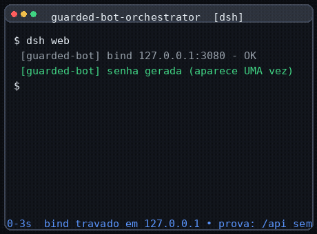

# dsh-guarded-bot-orchestrator

[](https://github.com/frederico-kluser/deepseek-harness-mobile/actions)
[](https://www.npmjs.com/package/dsh-guarded-bot-orchestrator)
[](https://www.npmjs.com/package/dsh-guarded-bot-orchestrator)
[](https://securityscorecards.dev/)

**Usa o teu próprio DeepSeek Harness pelo celular — a Web UI inteira, para codificar de verdade — sem nunca alargar o bind para fora do loopback: o túnel termina em `127.0.0.1` (acesso local abre direto), e pelo túnel só entra quem tem a chave no link `?key=` (que o bot envia) — ligas e desligas o acesso pelo Telegram.**



## Instalação (uma linha)

```sh
dsh plugin --profile web add dsh-guarded-bot-orchestrator
```

## Modelo de ameaça, em 5 linhas — antes de qualquer feature

> Este plugin expõe, por escolha, um agente que executa código na tua máquina. Antes de continuares, lê isto:
>
> 1. **O TLS termina na borda da Cloudflare.** O texto claro (prompts, código, respostas) passa por um terceiro — é o que permite WAF/Access/cache. Não é ponta-a-ponta.
> 2. **A URL do túnel é pública e não é segredo.** Quem protege é a chave `?key=` no link, não a obscuridade do endereço.
> 3. **Cloudflare Access não pode ficar na frente de um *quick tunnel*.** Sobre `*.trycloudflare.com` toda a autenticação tem de estar dentro da aplicação.
> 4. **O *quick tunnel* não tem SLA** — é "intended for testing and development only".
> 5. **Isto não é "seguro por padrão sem pensar".** Reduzimos a superfície, autenticámos a borda por chave/sessão e demos-te o botão de desligar; não eliminámos a categoria do risco.
>
> Detalhe e o que cada mitigação faz: [`docs/THREAT-MODEL.md`](docs/THREAT-MODEL.md).

## Modelo de segurança (o que o código garante de facto)

Leitura honesta das garantias — cada linha aponta para o código que a cumpre; nada aqui é
"seguro por padrão sem pensar", é redução de superfície e autenticação.

| Propriedade | Como |
| --- | --- |
| **O bind nunca é alargado** | `assertSecureBind` recusa `0.0.0.0`/`::` **no carregamento**, com falha ruidosa (`src/config/bind.ts`) |
| **Acesso local abre direto** | em `127.0.0.1` o DSH responde **sem barreira**; a proteção aplica-se à superfície do túnel, não ao loopback (`src/tunnel/proxy.ts`) |
| **Pelo túnel só entra com sessão ou chave no link** | o proxy autentica tudo: sessão (cookie) ou `?key=` no link; fora disso → `401` sem desafio (`src/http/gate.ts`, `src/session/link-token.ts`) |
| **Origem e Host vêm primeiro** | `trustedRemotes` (403 sem credencial) e `Host` byte-a-byte contra DNS rebinding (`src/http/gate.ts:15`, `src/http/host-header.ts`) |
| **Chave no link reutilizável, revogável por rotação** | CSPRNG 256 bits; guardada só como digest SHA-256; reutilizável até `/rotacionar` (gera chave nova e invalida sessões) ou derrubar o túnel (`src/session/link-token.ts`) |
| **O 401 é sem desafio** | texto puro, **sem desafio de login** (o popup do navegador foi removido) — nunca se pede senha em prompt/formulário (`src/http/responses.ts`, `denyUnauthorized`) |
| **Força bruta tem teto** | a 5ª falha começa a atrasar; 100 falhas acumuladas derrubam a exposição (modo restrito), só o loopback passa e o reiniciar não o contorna (`src/ratelimit/**`) |
| **Verificação da chave em tempo constante** | digest comparado com `timingSafeEqual`; o token redige-se em JSON/inspect (`src/session/link-token.ts`, `test/security/timing-constante.test.ts`) |
| **`danger-full-access` vetado** | elevação proibida recusada como defesa em profundidade (`src/permissions/deny.ts`) |
| **Só o dono pareado comanda o bot** | allowlist de `from.id` do Telegram (`worker/auth/allowlist.ts`) |
| **O que NÃO se garante** | o TLS termina na borda da Cloudflare (texto claro passa por lá); a URL do túnel não é segredo; quem tiver o link acede até rotacionar; a `?key=` viaja em query (visível a intermediários) — trade assumido pelo dono; *prompt injection* continua aceite — decisões de desenho em [`docs/THREAT-MODEL.md`](docs/THREAT-MODEL.md) §4 e §5.1 |
## A tensão central, dita por nós antes que digam por nós

O projeto foi construído para **travar** o DSH em loopback. Este plugin também o **expõe** pela internet. Parece contradição — e a formulação honesta é esta:

> O bind **continua** em `127.0.0.1` e o DSH aí **abre direto** (sem login). O que muda é que passa a existir um processo filho supervisionado (`cloudflared`) que leva o tráfego da borda da Cloudflare até um **proxy dedicado que autentica na borda** (sessão ou `?key=`). Não é o mesmo que `--host 0.0.0.0`: o socket local nunca é alargado, a exposição é **opt-in**, efémera e revogável em um comando — e quem proteger `/api`, o fallback da SPA e o handshake de WebSocket é esse proxy, não o loopback.
>
> O que **não** muda: a superfície de ataque lógica cresce. Antes, um atacante precisava de acesso à máquina; agora, pelo túnel, precisa da **chave no link** (ou de uma sessão roubada). Trocámos "inalcançável" por "alcançável e autenticado na borda" — sem login, sem senha a digitar. Essa troca é reversível a qualquer momento pelo botão de desligar (e a chave, pelo `/rotacionar`).

Quem não aceitar esta troca deve usar Tailscale ou SSH — e dizemo-lo com mais calma em [`docs/TUNNEL.md`](docs/TUNNEL.md) e na secção "Quando NÃO usar" abaixo.

## O que faz (e porquê)

1. **Protege o túnel, não o loopback.** O DSH abre **direto** em `127.0.0.1` (sem login); quem expõe é um **proxy dedicado** que autentica tudo o que chega da internet — `/api`, o fallback da SPA e o handshake de WebSocket. Recusa endereços de bind fora do loopback no carregamento e recusa permissões proibidas (`danger-full-access`). Resolve a superfície da discussão upstream [#853](https://github.com/deepseek-ai/deepseek-harness/discussions/853).
2. **Nunca pede senha a ninguém.** O acesso pelo túnel entra por **sessão** ou pela **chave no link** `?key=` (CSPRNG, 256 bits, digest em disco). A chave é **reutilizável** até `/rotacionar` (que gera chave nova e invalida sessões) ou derrubar o túnel. O 401 é **sem desafio de login** — não há prompt nem formulário de login.
3. **Suba um túnel efémero** para acederes pelo celular, com TTL que o derruba sozinho e um *probe fail-closed* que impede um túnel "nu" (sem proxy autenticado atrás).
4. **Ligar/desligar pelo Telegram ou painel** — o botão de matar na mão.

### Telegram: botão da UI e link automático

Na UI do DSH há o **botão do Telegram** (`/__guard-ui`), com estado **OFFLINE/ONLINE**
fiel ao runtime:
- **OFFLINE** → o clique mostra as instruções de conexão: criar o bot no `@BotFather`,
  `dsh-guard-setup --pedir-token`, `--parear`, enviar `/parear <código>`; quem segue
  esse passo a passo de facto coloca o bot **online**;
- **ONLINE** → mostra dicas de uso.

Depois de pareado (`docs/ONBOARDING-TELEGRAM.md`), os comandos de controlo do bot:

| Comando | O que faz |
| --- | --- |
| `/ligar` | Sobe o túnel e, quando fica READY, **envia automaticamente** o link com a chave `?key=` |
| `/desligar` | Derruba o túnel (e revoga a chave) |
| `/acessar` | (Re)envia o link com a chave |
| `/rotacionar` | Gera **chave nova** e invalida as sessões — revoga o acesso antigo |
| `/status` · `/emergencia` | estado, kill switch |

O link enviado no `/ligar` é
`https://<url-pública>/?key=<token>`: a **chave no link** autentica o túnel, é
**reutilizável** até rotacionar (ou derrubar o túnel) e, ao ser válida, é trocada
por uma **sessão** e o navegador é redirecionado para a URL limpa (sem `?key=`).
**Nunca se pede uma senha a digitar** — o acesso é por sessão ou por chave no
link, e o acesso local abre direto.

> **Porque a chave pode aparecer no chat (e é esperado):** o `?key=` é o mecanismo
> de autenticação e o bot é o canal de entrega. É **a chave do link**, não uma
> "senha permanente" — não há senha a digitar para acesso.

Cada promessa destas aponta para a linha de código que a cumpre: ver [`docs/ARCHITECTURE.md`](docs/ARCHITECTURE.md).

## Como flui um pedido (arquitetura em 8 linhas)

```
Telemóvel (navegador)
   │  abre o link que o bot enviou: https://<url>/<tunel>/?key=<token>   (a chave viaja em query)
   ▼
❨ Cloudflare edge ❩   TLS → HTTP/2 → WebSocket ; o TLS termina AQUI (texto claro passa pela borda)
   ▼
cloudflared — quick tunnel (conexão de saída apenas, sem conta, sem SLA)
   ▼  http://127.0.0.1:3080   (o túnel termina no loopback; o socket local NÃO é alargado)
plugin (proxy dedicado — só o túnel passa por aqui)
   │  autentica na borda: sessão (cookie) ou `?key=` válida → troca por sessão (302 p/ URL limpa)
   │  403 origem/ Host fora da allowlist · 401 SEM desafio (sem login) · 200 com sessão
   ▼
DeepSeek Harness Web UI — bind travado em 127.0.0.1 (nunca 0.0.0.0)
```

O que o diagrama esconde e é decisivo: **o acesso local abre direto** (sem barreira) — a autenticação vive só no proxy do túnel. A **chave no link** é gerada pela máquina (CSPRNG, 256 bits), guardada em disco só como digest, reutilizável até rotacionar, e a `?key=` viaja em query (visível a intermediários) — trade assumido do modelo expose-port. A recusa de bind fora do loopback acontece **no carregamento**, com falha ruidosa — ver o mapa de módulos em [`docs/ARCHITECTURE.md`](docs/ARCHITECTURE.md).

## Quickstart (5 comandos)

```sh
# 1. instala o plugin (uma linha; ativa o manifesto de Bundle automaticamente)
dsh plugin --profile web add dsh-guarded-bot-orchestrator

# 2. corre o DSH — o acesso local abre direto (sem login)
dsh web

# 3. (opcional) liga o bot: dsh-guard-setup + /parear (docs/ONBOARDING-TELEGRAM.md);
#    depois, no Telegram, /ligar envia o link com a chave ?key=

# 4. confirma que o acesso local abre (o DSH responde direto); a borda sem chave
#    dá 401 — ver docs/INSTALL.md Passo 3
curl -s -o /dev/null -w '%{http_code}\n' http://127.0.0.1:3080/

# 5. para desligar/desinstalar
dsh plugin remove dsh-guarded-bot-orchestrator
```

[`examples/minimal`](examples/minimal/) é um exemplo mínimo instalável com o critério de aceite documentado (local abre direto / borda sem `?key=` dá 401 / 200 com o link ou sessão / nenhum processo no fim).

## Quando NÃO usar isto

- **Time / multiusuário.** É um plugin de dono único: uma allowlist de `from.id` do Telegram e a chave do link. Não há RBAC nem auditoria multi-tenant.
- **Produção / uptime.** O *quick tunnel* é, nas palavras da própria Cloudflare, "intended for testing and development only" e "We don't guarantee any SLA or uptime".
- **Quem precisa de compliance.** O TLS termina na borda da Cloudflare; o texto claro passa por lá. Não é E2E.
- **Quem quer "seguro por padrão sem pensar".** Isto não existe aqui. Estás a expor um agente com shell; o plugin reduz superfície e entrega o kill switch, não elimina a categoria.
- **Máquina corporativa.** `trycloudflare.com` tem reputação de malware documentada e muitas redes/EDRs bloqueiam ou sinalizam `cloudflared`.

## Alternativas (comparação honesta)

Nenhuma alternativa é apresentada como ruim; várias são melhores em vários eixos. O valor está na combinação, não em vencer item a item.

| Alternativa | O que faz melhor | O que custa | Quando escolher **em vez** deste plugin |
| --- | --- | --- | --- |
| **Tailscale (+ Funnel)** | Rede privada real (WireGuard), identidade por dispositivo | Instalar cliente no celular e conta | **Quase sempre, se aceitas instalar o cliente** |
| **ngrok** | Ergonomia imediata; auth na borda no plano free (o quick tunnel não tem) | Limites free; URL muda | Quando queres auth **de borda** hoje |
| **SSH + tmux** | Sem superfície HTTP nova, E2E de verdade | Não é a Web UI; código no celular é castigo | Quando só precisas de ver log e matar processo |
| **code-server / VS Code tunnels** | Editor completo no browser | Não é o DSH; roda em paralelo | Quando o objetivo é editar ficheiro, não conduzir o agente |
| **`dsh-webui-auth`** | Autenticação da WebUI no transporte | Só autentica; sem túnel, sem bot, sem liga/desliga | **Se só queres autenticação, usa ele** |
| **Named tunnel + Cloudflare Access** | Auth **antes** de chegar à tua máquina | Exige domínio com DNS na Cloudflare | Sempre que tiveres domínio (caminho superior) |
| **Nada (loopback puro)** | Risco zero de exposição | Não usas do celular | Sempre que não precisares mesmo |

Em suma: isto **não é "mais um túnel"** — é o fluxo completo de um dono só (onboarding → chave no link → túnel efémero → link no celular → botão de desligar), com o bind travado em loopback e o acesso local aberto, sem login.

## Compatibilidade

Faixa suportada do upstream `@deepseek-ai/dsh`: **`0.1.0-rc.7 .. 0.1.1-rc.1`** (política N/N-1). A tabela completa — versão do plugin × faixa de rc × status — está em [`docs/COMPATIBILITY.md`](docs/COMPATIBILITY.md), que é **gerado** de `dsh-compat.yml` (nunca editado à mão).

> Atenção ao registry: a tag `latest` dos subpacotes `@deepseek-ai/dsh-*` aponta para a publicação **mais antiga**, não para a mais recente. Fixa a versão explicitamente.

## Validação end-to-end (o que a suíte prova de verdade)

Matriz de alto nível a partir das suítes **reais** do repo — `test/e2e/**`, `test/security/**`, `test/integration/**`
— referidas por ficheiro. São verificações que o CI corre, não promessas; o detalhe de cada nível e como correr
está em [`docs/TESTING.md`](docs/TESTING.md).

| Check | Expected | Onde está verificado |
| --- | --- | --- |
| Acesso **local** (`127.0.0.1`) a `/`, `/api/state`, upgrade | abre **direto**, `200`/`101`, **sem desafio** (o DSH não é guardado no loopback) | `test/integration/http/barreira.test.ts` (onda 1) |
| Pedido pela **URL do túnel** sem sessão e sem `?key=` | `401` TEXTO PURO, **sem desafio** (sem popup de login) | `test/e2e/tunnel-cycle.test.ts`, `test/security/desafio-401.test.ts` |
| `?key=<token>` **válido** pela URL do túnel | `302` para a URL **limpa** (+ `Set-Cookie` de sessão); o token **não** aparece nos logs | `test/unit/http/gate.test.ts`, `test/unit/tunnel/proxy.test.ts` |
| `?key=` **inválido** pela URL do túnel | `401` sem desafio, sem 302 | `test/unit/http/gate.test.ts`, `test/security/desafio-401.test.ts` |
| Com sessão válida (cookie) pela URL do túnel | `200`, resposta vem do despacho original | `test/e2e/tunnel-cycle.test.ts` |
| Handshake de WebSocket de origem estranha (ex.: `https://evil.com`) | recusado — allowlist exata de `Origin` (CWE-1385) | `test/security/websocket-origin.test.ts` |
| `Host` que não é o publicado / DNS rebinding | `403` no perímetro, byte-a-byte | `test/security/host-header.test.ts`, `test/e2e/tunnel-cycle.test.ts` |
| Rota contornada (`/..//api`, `%2e`, barras duplicadas, `/__guard/API/login`) | uniforme `401/403/404`, nunca pass-through | `test/security/path-bypass.test.ts` (ADV-001..020) |
| 100.ª falha de força bruta | modo restrito acende, **persiste** após reinício, chave/sessão pelo túnel negadas e o loopback passa | `test/security/nist-ceiling.test.ts` |
| Segredo/chave a vazar (logs, respostas, frames IPC, payloads do Telegram, env, state) | canário por valor falha se vazar | `test/security/secret-leak-canary.test.ts` (ADV-050..059) |
| A comparação da chave vaza tempo? | prova estatística de tempo constante | `test/security/timing-constante.test.ts` |
| Ciclo completo do túnel com processos reais | start → READY → 401 pela URL → 200 com sessão → stop, **sem processo órfão** | `test/e2e/tunnel-cycle.test.ts` (T6.1) |

Honestidade sobre o que esta matriz **não** é: o e2e usa um *fake-cloudflared* e uma borda
falsa — **nenhum byte sai de `127.0.0.1` no CI**, por construção. A re-confirmação **através** da borda
e da rede reais é a suíte `test/live/**` (`DSH_GUARD_LIVE_TESTS=1`), opt-in e fora do gate —
ver `docs/TESTING.md` §5.

## Desinstalar e reverter

```sh
dsh plugin remove dsh-guarded-bot-orchestrator
```

Deixa zero processos remanescentes e a Web UI volta ao comportamento original. Para apagar também a chave do link, o pareamento e o estado local: remove `~/.dsh/guarded-bot`. Detalhe em [`docs/INSTALL.md`](docs/INSTALL.md).

## Docs

- [`docs/INSTALL.md`](docs/INSTALL.md) — instalação passo a passo
- [`docs/ONBOARDING-TELEGRAM.md`](docs/ONBOARDING-TELEGRAM.md) — conectar o bot e parear
- [`docs/EXPOSURE.md`](docs/EXPOSURE.md) — o que muda quando o túnel sobe
- [`docs/TUNNEL.md`](docs/TUNNEL.md) — quick vs named, TTL, modelo de ameaça do transporte
- [`docs/THREAT-MODEL.md`](docs/THREAT-MODEL.md) — atacante, mitigação, o que não mitiga
- [`docs/TROUBLESHOOTING.md`](docs/TROUBLESHOOTING.md) — sintoma → causa → o que fazer
- [`docs/ARCHITECTURE.md`](docs/ARCHITECTURE.md) — costuras Cordis e mapa de módulos
- [`docs/TESTING.md`](docs/TESTING.md) — como rodar cada nível de teste

## Contribuir e reportar

- Encontraste uma vulnerabilidade? **Não abras issue pública.** Lê [`SECURITY.md`](SECURITY.md) e usa o canal privado lá descrito (Private Vulnerability Reporting ou e-mail).
- Queres contribuir? [`CONTRIBUTING.md`](CONTRIBUTING.md) tem o ambiente em quatro comandos, os níveis de teste e o que nunca é aceite num PR.
- Código de conduta: [`CODE_OF_CONDUCT.md`](CODE_OF_CONDUCT.md).

Licença MIT — [`LICENSE`](LICENSE). O DeepSeek Harness a montante também é MIT.
